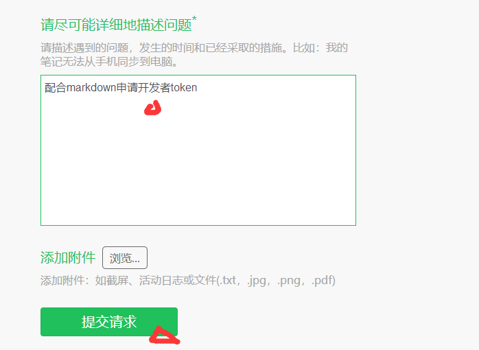

# markdown基本使用教程
### 首先需要注册一个印象笔记，然后注册申请开发者token



#### 提交请求之后就可以等待客服发送邮件，收到开发者token
***
#### 打开vscode 安装markdown插件 点击如下图标

#### 搜索markdown 找到如下两个进行安装

#### 然后继续搜索evermonkey 安装如下插件

***
#### 安装完毕（印象笔记客服发来开发者token之后）开始配置开发者token键盘按住  'ctrl' + 'shift' + 'p' 选择 Ever token 点击，然后选择China，然后看图示操作


#### 记住这两个地方 Developer token 和 noteStore URL,然后返回vscode点击vscode左下角处，选择设置

#### 在搜索出输入token，将下面两个在设置中替换


#### 将刚才的token 和URL 复制粘贴到下面对应的地方的引号里面，然后保存配置完毕重新启动vscode

***
## 新建笔记
#### 打开vscode 键盘操作 'ctrl' + 'shift' + 'p'选择Ever new,或者直接键盘‘ALT’ + 'N'即可新建笔记

#### 新建之后如下，填写标题，标签，笔记在下面填写内容

***
## 基本操作
## 分级标题

第一种写法:

```markdown
这是一个一级标题
============================

这是一个二级标题
--------------------------------------------------
```

> 这是一个一级标题
> ============================
> 这是一个二级标题
> --------------------------------------------------

---

第二种写法:

```markdown
# 一级标题
## 二级标题
### 三级标题
#### 四级标题
##### 五级标题
###### 六级标题
```

> # 一级标题
> ## 二级标题
> ### 三级标题
> #### 四级标题
> ##### 五级标题
> ###### 六级标题

## 分隔线

你可以在一行中用三个以上的星号、减号、底线来建立一个分隔线, 行内不能有其他东西。你也可以在星号或是减号中间插入空格。下面每种写法都可以建立分隔线:

``` markdown
* * *

***

*****

- - -

---------------------------------------
```

> * * *
> - - -
## 区块引用

区块引用需要在被引用的文本前加上 `>` 符号。

```markdown
> 这是一个区块引用实例,

> Markdown.
```

> 这是一个区块引用实例,

> Markdown.

Markdown 也允许你偷懒只在整个段落的第一行最前面加上 `>` :

```markdown
> 平生不会相思,
才会相思,
便害相思。

> 空一缕余香在此,
盼千金游子何之。
```

> 平生不会相思,
才会相思,
便害相思。

> 空一缕余香在此,
盼千金游子何之。
### 斜体

```markdown
*花自飘零水自流*
```

> *花自飘零水自流*

### 粗体

```markdown
**花自飘零水自流**
```

> **花自飘零水自流**
## 列表

使用 *，+，- 表示无序列表。

### 无序列表

```markdown
- 白头吟
- 击鼓
- 断句
```

> - 白头吟
> 
> - 击鼓
> 
> - 断句

### 有序列表

有序列表则使用数字接着一个英文句点。

```markdown
1. 白头吟
2. 击鼓
3. 断句
```

> 1. 白头吟
> 
> 2. 击鼓
> 
> 3. 断句
## 插入图片
语法中图片Alt的意思是如果图片因为某些原因不能显示, 就用定义的图片Alt文字来代替图片。 图片Title则和链接中的Title一样, 表示鼠标悬停与图片上时出现的文字。 Alt 和 Title 都不是必须的, 可以省略, 但建议写上。


``

```markdown
要是本地图片最好和markdown在同一文件夹下，即可直接写出图片的名字，否则需要写清楚图片的具体位置，网上图片写好网址即可。

```


## 表格

1. 不管是哪种方式, 第一行为表头, 第二行分隔表头和主体部分, 第三行开始每一行为一个表格行。
2. 列于列之间用管道符`|`隔开。原生方式的表格每一行的两边也要有管道符。
3. 第二行还可以为不同的列指定对齐方向。默认为左对齐, 在`-`右边加上`:`就右对齐。

简单方式:

```markdown
诗名|作者|朝代
-|-|-
白头吟|卓文君|两汉
锦瑟|李商隐|唐代
登科后|孟郊|唐代
```

诗名|作者|朝代
-|-|-
白头吟|卓文君|两汉
锦瑟|李商隐|唐代
登科后|孟郊|唐代

原生方式:

```markdown
|诗名|作者|朝代|
|-|-|-|
|白头吟|卓文君|两汉|
|锦瑟|李商隐|唐代|
|登科后|孟郊|唐代|
```

|诗名|作者|朝代|
|-|-|-|
|白头吟|卓文君|两汉|
|锦瑟|李商隐|唐代|
|登科后|孟郊|唐代|

为表格第二列指定方向:

```markdown
诗名|名句
-|-:
梦微之|君埋泉下泥销骨。
上邪|上邪，我欲与君相知，长命无绝衰。
```

诗名|名句
-|-:
梦微之|君埋泉下泥销骨。
上邪|上邪，我欲与君相知，长命无绝衰
***
### 推送

键盘操作 'ctrl' + 'shift' + 'p'选择Ever publish,或者直接键盘‘ALT’ + 'P'即可将笔记推送到印象笔记